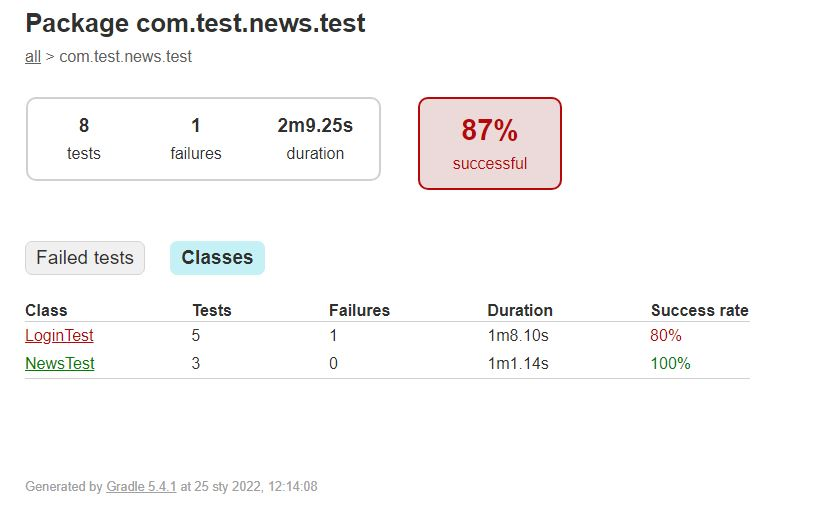

# Technical assignment's output

## Used technologies

* Kaspresso was used to create abstraction layer over verbose espresso's syntax.
* Page Object pattern was used to encapsulate screens/elements and corresponding interactions.
* Automation covered as many scenarios as possible.

## Found issues

The first story can't be moved to Done column yet, there's an issue that needs to be addresed.

The second story was tested and there's no issue here, can be moved to Done column.

### 1. As a user I want to log in to the app

#### Scenario 4 - user opens app next time (when previously logged in)

**Steps to reproduce:**
- the user opens app next time (when previously logged in)

**Expected:**

User is on News Screen

**Actual:**

User is on Log In Screen and needs to re-log in